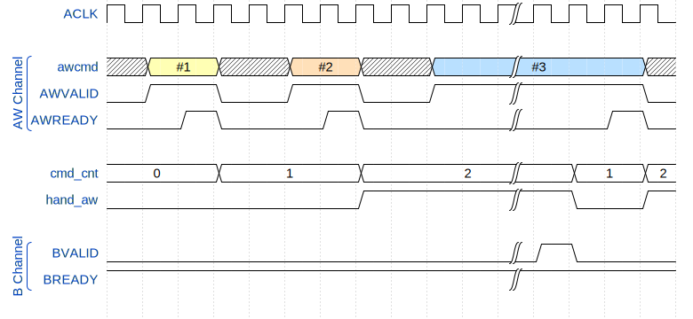
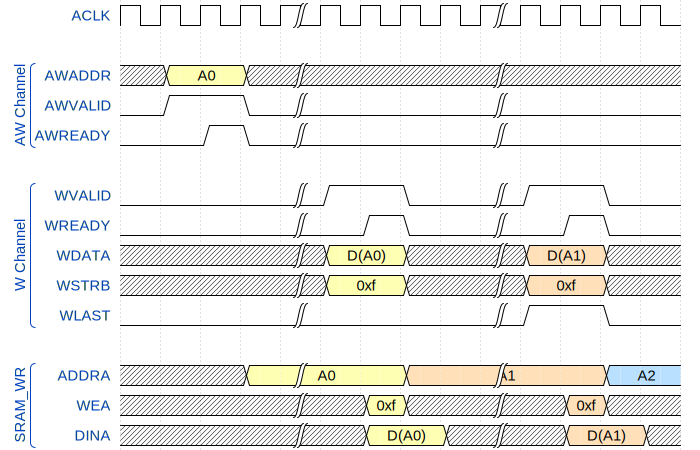
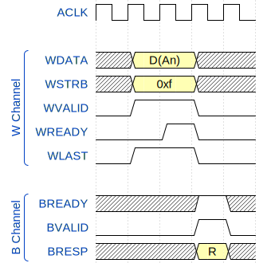
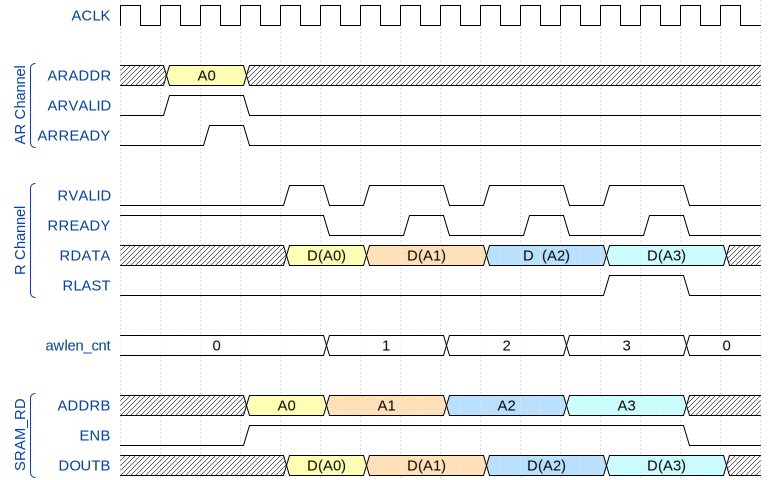
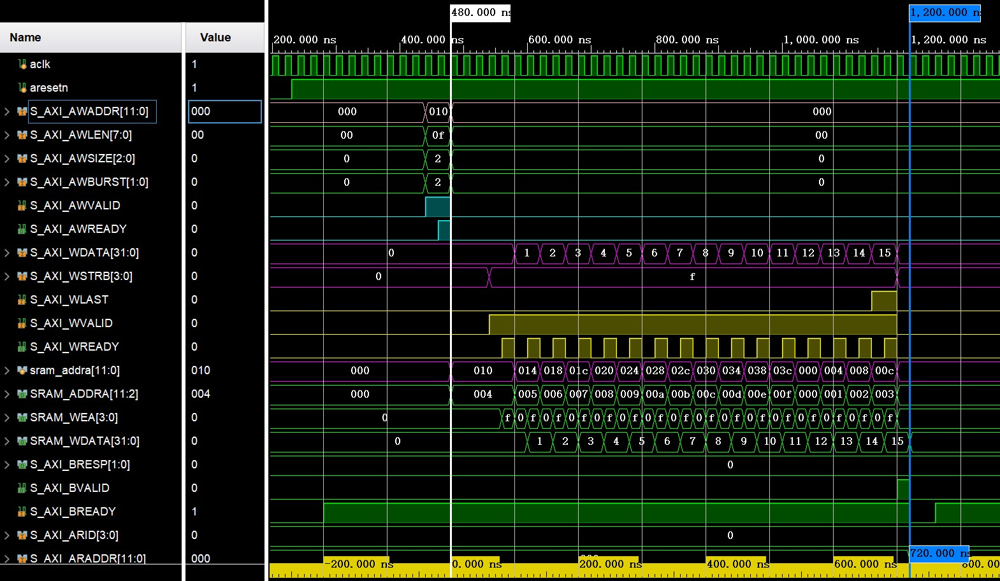
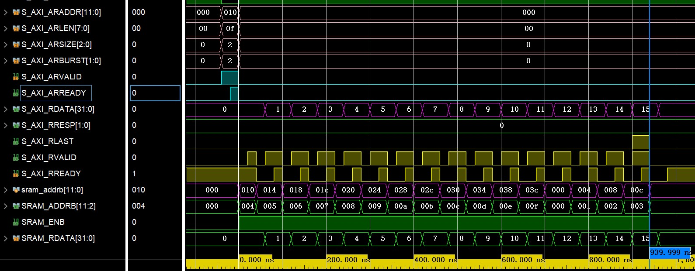

AXI4 Protocol (E1): AXI4 SRAM Design
==========================

SRAM 无论作为片内单独的存储器，还是作为 SoC 中其它组件的 buffer, 都不可避免的需要和片上总线之间进行协议转换。本文将对**带 AXI4 接口的 Simple Dual Port SRAM 的设计思路**进行简单介绍。

## Chapter 1 AXI4 SRAM 功能概述

主要介绍 AXI4 SRAM 模块的 Feature，端口信号和内部模块划分。

### 1.1 Feature

AXI4 SRAM 的功能特性如下：
- 容量为 4KB;
- 由于采用了 **Simple Dual Port SRAM**, R Channel 和 W Channel 能够同时进行读写操作，且不会出现冲突；
- 支持 INCR, WRAP 读写操作，Burst Length 未作限制，即可以达到 128;
- **不支持非对齐操作**，即在 master 发出非对齐地址的条件下，模块会进行对齐处理；
- 不支持 outstanding 操作，即 outstanding 为 1. 读/写的 Outstanding 是分开计算的。

### 1.2 接口信号

AXI4 接口信号如下：
|   AW      |   W       |   B       |   AR      |   R       |
|   :--:    |   :--:    |   :--:    |   :--:    |   :--:    | 
|   AWID    |   WDATA   |   BID     |   ARID    |   RID     |
|   AWADDR  |   WSTRB   |   BRESP   |   ARADDR  |   RDATA   |
|   AWLEN   |   WLAST   |   BUSER   |   ARLEN   |   RRESP   |
|   AWSIZE  |   WUSER   |   BVALID  |   ARSIZE  |   RLAST   |
|   AWBURST |   WVALID  |   BREADY  |   ARBURST |   RUSER   |
|   AWLOCK  |   WREADY  |   -       |   ARLOCK  |   RVALID  |
|   AWCACHE |   -       |   -       |   ARCACHE |   RREADY  |
|   AWPROT  |   -       |   -       |   ARPROT  |   -       |
|   AWQOS   |   -       |   -       |   ARQOS   |   -       |
|   AWREGION|   -       |   -       |   ARREGION|   -       |
|   AWUSER  |   -       |   -       |   ARUSER  |   -       |
|   AWVALID |   -       |   -       |   ARVALID |   -       |
|   AWREADY |   -       |   -       |   ARREADY |   -       |

部分信号的位宽定义如下：
- ID类信号
`AWID`, `BID`, `ARID`, `RID` 位宽自定义，此设计中定义为4。
- 地址类信号
`AWADDR` 和 `ARADDR`，通过参数 `C_S_AXI_ADDR_WIDTH` 定义，此设计中，定义为12，刚好为 4KB。
- 传输配置信号
`AxQOS`: 4-bit
`AxREGION`: 4-bit

Simple Dual Port SRAM 接口信号如下：
|   Name    |   Direction   |   Width   |   Description |
|   :--:    |   :--:        |   :--:    |   :--:        |
|   clka    |   IN          |   1       |   -           |
|   addra   |   IN          |   12      |   -           |
|   wea     |   IN          |   4       |   -           |
|   dina    |   IN          |   32      |   -           |
|   clkb    |   IN          |   1       |   -           |
|   addrb   |   IN          |   12      |   -           |
|   enb     |   IN          |   1       |   -           |
|   doutb   |   OUT         |   32      |   -           |

### 1.3 内部模块划分

顶层模块为`axi4_sram`, 模块划分为了`s_axi4_interface` 和 `sram_dp`.

## Chapter 2 AXI4 SRAM 设计思路

该部分主要讲述各个通道的输出端口信号的时序关系和实现逻辑。

### 2.1 AW Channel

AW Channel 中，主要关注 `AWVALID` 信号的控制。

首先展示与 AW Channel 相关的各个信号之间的时序关系：



其中，`awcmd` 包含了地址信号和控制信号。握手方式参考的资料如下：

> IHI0022E A3.2.1 *Figure A3-2 VALID before READY handshake*

此外，时序图假设了 outstanding 为 2，**考虑到outstanding特性，额外添加了 `hand_aw` 信号**，由 `cmd_cnt` 控制，用于指示slave能否接收 master 发起的 transaction 请求。

由于 sram 通常用不到 outstanding 特性，为简化设计难度，将outstanding最大值设为 1（砍掉 `cmd_cnt`）。其基本思路为：
1. 当 `AWREADY` 和 `AWVALID` 握手成功时，`hand_aw` 拉高，此时不能接收 transaction 请求；
2. 当 `BVALID` 和 `BREADY` 握手成功时，代表当前写传输结束，可以进行下一个 transaction 的请求。

`hand_aw` 指示信号的具体逻辑如下：

```verilog {.line-numbers}
    always_ff @(posedge S_AXI_ACLK or negedge S_AXI_ARESETn) begin
        if (!S_AXI_ARESETn) begin
            hand_aw <=  1'b0;
        end

        else if (awvalid && awready) begin
            hand_aw <=  1'b1;
        end

        else if (bvalid && bready) begin
            hand_aw <=  1'b0;
        end

        else begin
            hand_aw <=  hand_aw;
        end
    end
```

笔者后续会扩展 outstanding 特性，修改 hand_aw的逻辑。

在此基础上，实现握手联络，从而对 transaction 的请求进行控制。握手联络的逻辑如下：

```verilog {.line-numbers}
    always_ff @(posedge S_AXI_ACLK or negedge S_AXI_ARESETn) begin
        if (!S_AXI_ARESETn) begin
            awready <=  1'b0;
        end

        else if (awvalid && (~awready) && (~hand_aw)) begin
            awready <=  1'b1;
        end

        else begin
            awready <=  1'b0;
        end
    end
```

### 2.2 W Channel

W Channel 需要关注的点如下：
- 写地址的自递增；
- AXI4 接口写操作到 SRAM 写操作的转换；
- `WREADY` 和 `WVALID` 之间的握手联络。

`WREADY` 信号的控制逻辑与 `AWREADY` 的基本相同，因此不再赘述。

#### 2.2.1 AXI4 to SRAM 写时序转换

AXI4 接口和 SRAM 写数据接口之间的时序转换关系如下：



存储器接口写操作的逻辑为：
1. AW Channel 握手成功时，载入 `AWADDR` 的值到 `addra`；W Channel握手成功时，**`addra` 根据 write transaction 的属性进行自递增**，具体的递增方式详见2.2.2；
2. 在 `WVALID` 和 `WREADY` 均为高电平时，`WEA` 有效，代码如下：

```verilog {.line-numbers}
    assign  sram_wea    =   (wready & wvalid) ?
                            S_AXI_WSTRB :
                            {(C_S_AXI_DATA_WIDTH/8){1'b0}};
```

3. 将 `WDATA` 打一拍送到 `DINA`.

#### 2.2.2 写地址计算

写地址的自增由 `AWBURST`, `AWSIZE`, `AWLEN` 共同决定。

此处着重讨论 WRAP 模式下的写地址自增计算过程参考了如下资料：
> 1. IHI0022E A3.4.1~A3.4.2
> 2. [AXI4协议详解（二）](https://mp.weixin.qq.com/s/b87ZkPyX68vYoiMXLjjB9g)

根据如下公式：
`Number_Bytes = 2 ^ AxSIZE`
使用查表法计算一个 transaction 中的 `Number_Bytes`: 

```verilog {.line-numbers}
    always_comb begin
        case (awsize)
            3'b000:     wr_num_bytes    =   'd1;
            3'b001:     wr_num_bytes    =   'd2;
            3'b010:     wr_num_bytes    =   'd4;
            3'b011:     wr_num_bytes    =   'd8;
            3'b100:     wr_num_bytes    =   'd16;
            3'b101:     wr_num_bytes    =   'd32;
            3'b110:     wr_num_bytes    =   'd64;
            3'b111:     wr_num_bytes    =   'd128; 
            default:    wr_num_bytes    =   'bx;
        endcase
    end
```

换一个通俗的方式理解 WRAP 模式下地址递增的过程。如下图所示，展示了地址自递增的情况：


从图中能看出，如果**当前地址 (Address) 超过了「回环上边界」（这里的「回环上边界」指 「实际上边界」减去`Number_Bytes`），那么下一地址要在当前地址的基础上减去 `(Burst_Length-1) * Number_Bytes`**.

如何判断当前地址是否超过了「回环上边界」呢？原始思路为：
判断
`Address % (Burst_Length * Number_Bytes) >= (Burst_Length - 1) * Number_Bytes` 
是否成立。

定义变量 `wrap_size` 为：
`wrap_size = (Burst_Length-1) * Number_Bytes = AxLEN * (2 ^ AxSIZE) = AxLEN << AxSIZE`

因此，`wrap_size` 可化简为如下的逻辑：

```verilog {.line-numbers}
    assign  aw_wrap_size    =   {4'h0,awlen} << awsize;
```

根据 Spec 的 A4.3.1 部分，规定了 wrapping burst 的 burst长度必须为 2, 4, 8, 16. **意味着 `Burst_Length * Number_Bytes` 只有有效最高位为 1, 其余位均为 0**.

规定如下变量的符号为：
- `Burst_Length * Number_Bytes` 的有效最高位为 `MSB(Burst_Length * Number_Bytes)`
-  `wrap_size` 的有效最高位为 `MSB(wrap_size)`
-  `Number_Bytes` 的有效最高位为 `MSB(Number_Bytes)`.

能推出如下结论：
- `MSB(wrap_size) = MSB(Burst_Length * Number_Bytes) - 1` 且 `MSB(wrap_size) >= MSB(Number_Bytes)`
- `wrap_size[MSB(wrap_size):MSB(Number_Bytes)]` 所有 bits 全为 1.

**要保证原始思路中的余数大于 `wrap_size`, 只需保证当前地址的 `Address[MSB(wrap_size):0]` 部分大于 `wrap_size`**. 因此，引入 `aw_wrap_en` 信号，其逻辑如下：

```verilog {.line-numbers}
    assign  aw_wrap_en      =   ((awaddr & aw_wrap_size) == aw_wrap_size) ?
                                1'b1:
                                1'b0;
```

根据 AXI4 to SRAM 接口写数据时序图，得出最终写地址的控制逻辑：

```verilog {.line-numbers}
    always_ff @(posedge S_AXI_ACLK or negedge S_AXI_ARESETn) begin
        if (!S_AXI_ARESETn) begin
            awaddr  <=  {(C_S_AXI_ADDR_WIDTH){1'b0}};
        end

        else if (awvalid && awready) begin
            awaddr  <=  S_AXI_AWADDR;
        end

        else if (wvalid && wready) begin
            case (awburst)
                S_AXI_FIXED: begin
                    awaddr  <=  awaddr;
                end 

                S_AXI_INCR: begin
                    awaddr  <=  awaddr + wr_num_bytes;
                end

                S_AXI_WRAP: begin
                    if (aw_wrap_en) begin
                        awaddr  <=  awaddr - aw_wrap_size;
                    end

                    else begin
                        awaddr  <=  awaddr + wr_num_bytes;
                    end
                end

                default: begin
                    awaddr  <=  awaddr;
                end
            endcase
        end

        else begin
            awaddr  <=  awaddr;
        end
    end
```

### 2.3 B Channel

B Channel 的时序图如下：



`BVALID`的逻辑如下：
1. 当 `WVALID`, `WREADY`, `WLAST` 均为高电平时，**transaction 的所有数据传输完成**，`BVALID` 拉高；
2. 当检测到 `BVALID` 和 `BREADY` 均为高时，将其拉低。

具体代码如下：

```verilog {.line-numbers}
    always_ff @(posedge S_AXI_ACLK or negedge S_AXI_ARESETn) begin
        if (!S_AXI_ARESETn) begin
            bvalid  <=  1'b0;
        end

        else if (wvalid && wready && wlast) begin
            bvalid  <=  1'b1;
        end

        else if (bready && bvalid) begin
            bvalid  <=  1'b0;
        end

        else begin
            bvalid  <=  bvalid;
        end
    end
```

简单起见，`BRESP` 暂时省略，保持 `OKAY` 即可。`BRESP` 的控制逻辑笔者会在后续更新。

### 2.4 AR Channel

AR Channel 的时序与 AW Channel 的基本一致。

### 2.5 R Channel

R Channel 的读地址递增方式与 W Channel 的写地址递增方式一致，不做赘述。

R Channel 的 AXI4 to SRAM 读时序转换如下：



其中，`RVALID` 由 `ENB` 和 `RREADY` 共同控制。

`ENB` 在 AR Channel 握手成功后拉高，在 R Channel 最后一笔传输结束后拉低，具体逻辑如下：

```verilog {.line-numbers}
    always_ff @(posedge S_AXI_ACLK or negedge S_AXI_ARESETn) begin
        if (!S_AXI_ARESETn) begin
            sram_enb    <=  1'b0;
        end

        else if (arready && arvalid) begin
            sram_enb    <=  1'b1;
        end

        else if (rready && rvalid && rlast) begin
            sram_enb    <=  1'b0;
        end

        else begin
            sram_enb    <=  sram_enb;
        end
    end
```

`RVALID` 控制逻辑大致为：
1. 当 `ENB` 开始拉高后的一个周期，`RVALID` 拉高；
2. 当 `RVALID` 和 `RREADY` 握手成功后，`RVALID` 被拉低一个周期；
3. 在 `RVALID` 被拉低后，若 `ENB` 为高，即正在进行 transaction 时，将 `RVALID` 拉高。

具体代码如下：

```verilog {.line-numbers}
    always_ff @(posedge S_AXI_ACLK or negedge S_AXI_ARESETn) begin
        if (!S_AXI_ARESETn) begin
            rvalid  <=  1'b0;
        end

        else if (rvalid && rready) begin
            rvalid  <=  1'b0;
        end

        else if (sram_enb && (~rvalid)) begin
            rvalid  <=  1'b1;
        end

        else begin
            rvalid  <=  rvalid;
        end
    end
```

最后 `RLAST` 的控制逻辑值得注意，笔者在初次仿真测试时在这个地方出现过小 bug，因此专门进行讨论。

再次观察 AXI4 to SRAM 读时序转换图，引入了 `awlen_cnt`，主要用于**记录一笔 transaction 中已完成了多少笔 transfer**。
1. 当 `awlen_cnt` 大于等于 `AWLEN` 时，说明即将或正在进行最后一笔 transfer；
2. 在满足1中所述条件下，**将 `RLAST` 和 `RVALID` 进行关联**，即可保证在进行最后一笔 transfer 的过程中拉高 `RLAST`，否则会在 `AWLEN = 8'h00` 时，出现 `RLAST` 一直拉高的情况。

`RLAST` 的控制逻辑汇总如下：

```verilog {.line-numbers}
    assign  rlast   =   (arlen_cnt >= arlen)    ?
                        rvalid  :
                        1'b0    ;
```

## Chapter 3 AXI4 SRAM 仿真环境搭建

使用 AXI Verification IP 与待测模块直连，参考以下资料搭建了 testbench:

> 1. PG267 *AXI Verification IP v1.1 LogiCORE IP Product Guide*
> 2. [FPGA 从入门到精通（番外篇）- AXI VIP 的使用](https://zhuanlan.zhihu.com/p/346532943)
> 3. [AXI VIP 的简单使用](https://blog.csdn.net/linbian1168/article/details/123770641)

## Chapter 4 仿真结果分析

测试激励中，AXI4 的 write/read transaction 属性如下：
- `AxADDR = 12'h010`
- `AxSIZE = 3'b000`
- `AxLEN = 8'd15`
- `AxBURST = WRAP`

AXI4 的 write transaction 的仿真波形如下：



AXI4 的 read transaction 的仿真波形如下：



读写时序均符合预期；除出现了如下报错外，均符合协议规范。

> Error: [Master VIP_wr_driver] (axi_vip_pkg.\axi_mst_wr_driver(C_AXI_ADDR_WIDTH=12,C_AXI_WID_WIDTH=4,C_AXI_RID_WIDTH=4,C_AXI_AWUSER_WIDTH=4,C_AXI_WUSER_WIDTH=4,C_AXI_BUSER_WIDTH=4,C_AXI_ARUSER_WIDTH=4,C_AXI_RUSER_WIDTH=4)::b_channel .B_CHANNEL) 1200 ns : B Channel serviceing did not find a matching transaction for write response id=0x0 in write channel queue.

对比了读写一致性后，TCL Command 输出的结果如下；在初步仿真后，模块功能符合预期。

> No_0 beat chk successful,the value is 0 
No_1 beat chk successful,the value is 1 
No_2 beat chk successful,the value is 2 
No_3 beat chk successful,the value is 3 
No_4 beat chk successful,the value is 4 
No_5 beat chk successful,the value is 5 
No_6 beat chk successful,the value is 6 
No_7 beat chk successful,the value is 7 
No_8 beat chk successful,the value is 8 
No_9 beat chk successful,the value is 9 
No_10 beat chk successful,the value is 10 
No_11 beat chk successful,the value is 11 
No_12 beat chk successful,the value is 12 
No_13 beat chk successful,the value is 13 
No_14 beat chk successful,the value is 14 
No_15 beat chk successful,the value is 15 

此外，将 `AxADDR` 设置为 `12'h012`, 输出的警告如下：

> Fatal: AXI4_ERRM_ARADDR_WRAP_ALIGN: For a wrapping burst, the start address must be aligned to the size of each transfer. Spec: section A3.4.1.

因此 master 在进行读写操作时，发出的地址必须对齐。

---

## Reference

> 1. IHI0022E *AMBA AXI and ACE Protocol Specification*
> 2. PG267 *AXI Verification IP v1.1 LogiCORE IP Product Guide*
> 3. [AXI4协议解析](https://mp.weixin.qq.com/s/b87ZkPyX68vYoiMXLjjB9g)

---

[Back](../../../README.md)